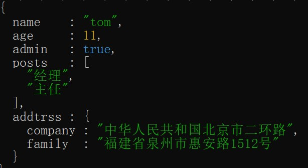
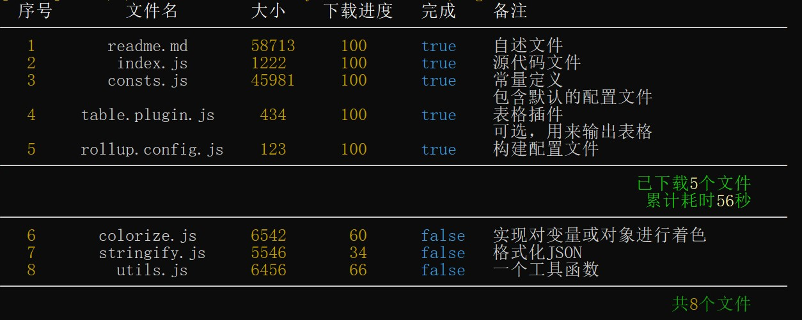
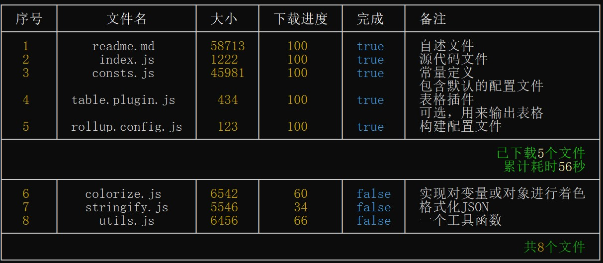
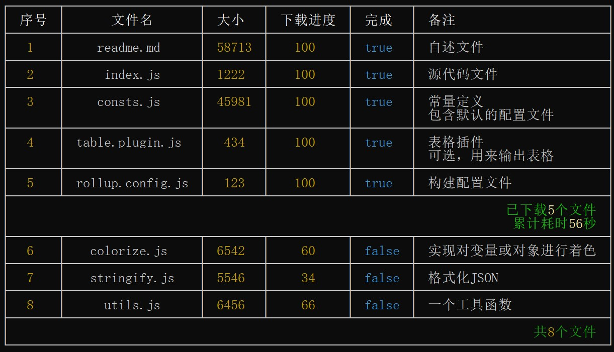
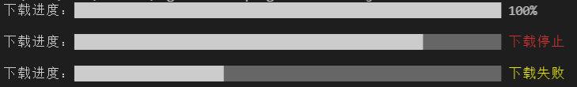
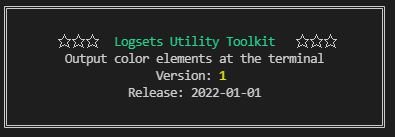
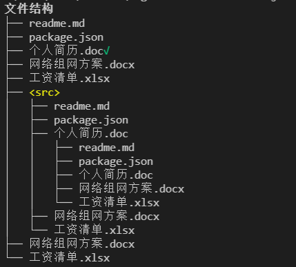

为开发`nodejs`命令行程序提供丰富的表现输出样式，支持以下特性：

- 支持按不同数据类型以不同的颜色显示，并且可以配置显示样式
- 支持按`DEBUG`、`INFO`、`WARN `、`ERROR `、`FATAL`五个级别输出日志
- 支持输出带颜色的模板字符串
- 支持自动格式化显示`{}`和`[]`类型
- 支持强大的表格输出
- 支持输出任务列表、进度条、横幅和树等扩展
- 正确处理中文与英文混排时的对齐问题

# 安装

```shell
npm install logsets
yarn add logsets
pnpm add logsets
```

# 输出效果

- 模板字符串输出


- 按数据类型输出


- 格式化输出对象




- 输出日志级别


- 表格输出


 




- 进度条



- 横幅




- 任务列表

 

- 树




# 文档

[文档](https://zhangfisher.github.io/logsets/)
