为开发`nodejs`命令行程序提供丰富的表现输出样式，支持以下特性：

- 支持按不同数据类型以不同的颜色显示，并且可以配置显示样式
- 支持按`DEBUG`、`INFO`、`WARN `、`ERROR `、`FATAL`五个级别输出日志
- 支持输出带颜色的模板字符串
- 支持自动格式化显示`{}`和`[]`类型
- 支持强大的表格输出
- 支持输出任务列表、进度条、横幅和树等扩展
- 正确处理中文与英文混排时的对齐问题
- 提供任务执行列表显示


# **开源推荐：** 

- **`VoerkaI18n`**: [基于Nodejs/React/Vue的一键国际化解决方案](https://zhangfisher.github.io/voerka-i18n/)
- **`Logsets`**: [命令行应用增强输出库](https://zhangfisher.github.io/logsets/)
- **`FlexDecorators`**:  [JavaScript/TypeScript装饰器开发](https://zhangfisher.github.io/flex-decorators/)
- **`FlexState`**:  [有限状态机实现]](https://zhangfisher.github.io/flexstate/)
- **`AutoPub`**:  [基于pnpm/monorepo的自动发包工具](https://zhangfisher.github.io/autopub/)


# 安装

```shell
npm install logsets
yarn add logsets
pnpm add logsets
```

# 使用文档

访问[官方文档](https://zhangfisher.github.io/logsets/)

# 输出效果

- 模板字符串输出

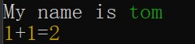

- 按数据类型输出

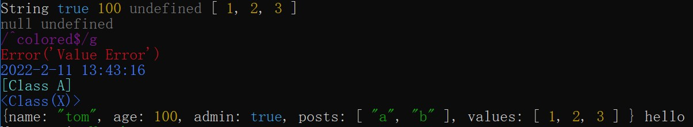

- 格式化输出对象

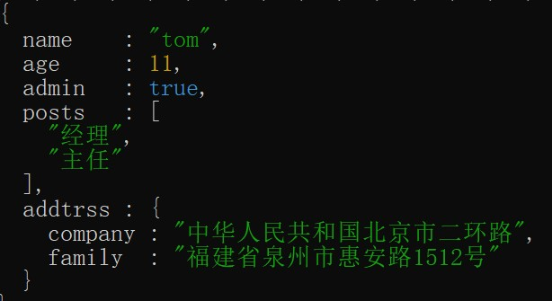
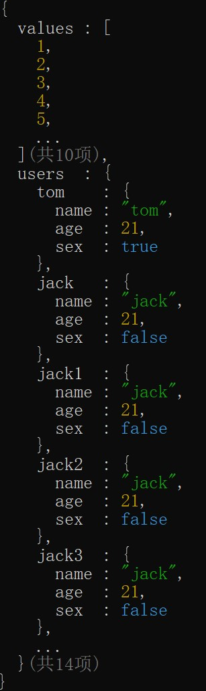

- 输出日志级别


- 表格输出

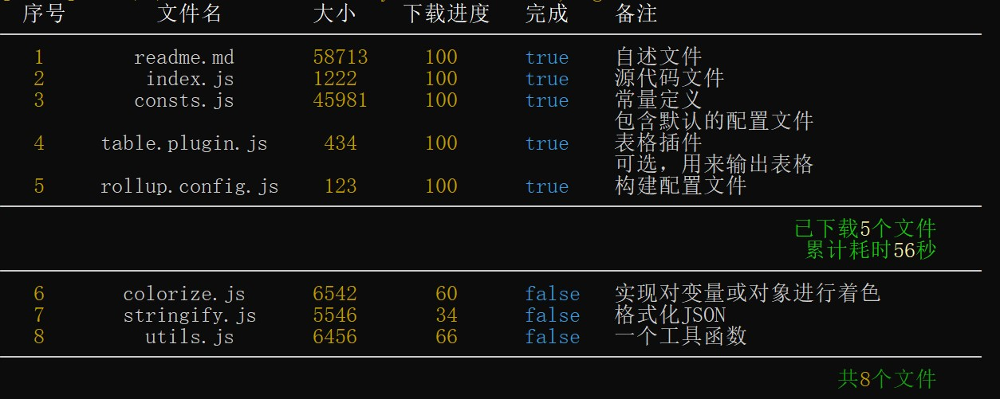
 
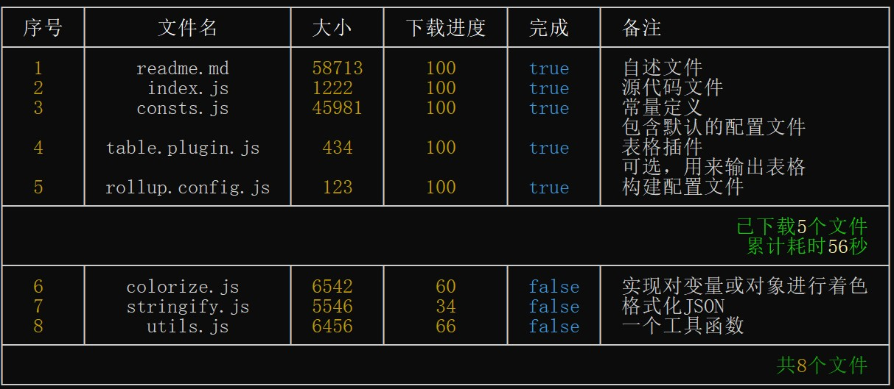

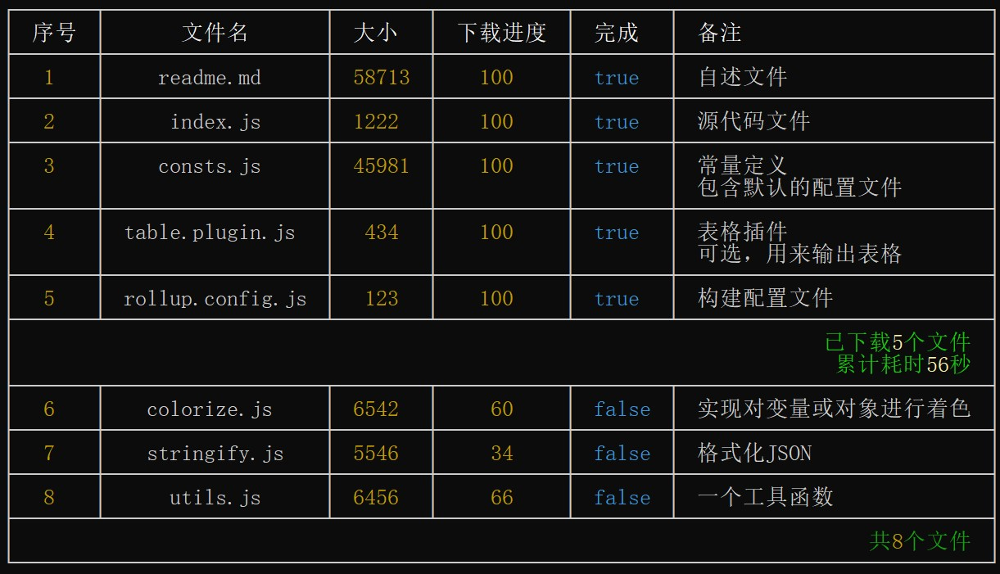

- 进度条

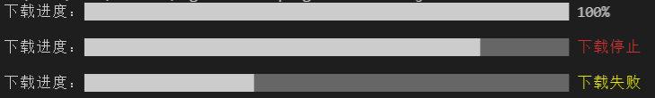

- 横幅

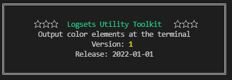
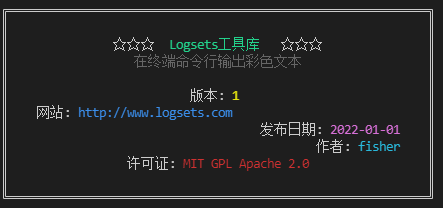


- 任务列表

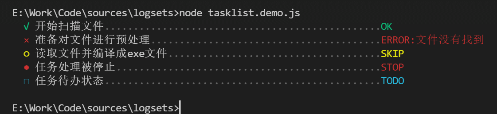 
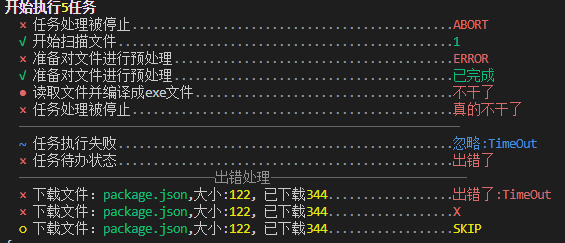 


- 树

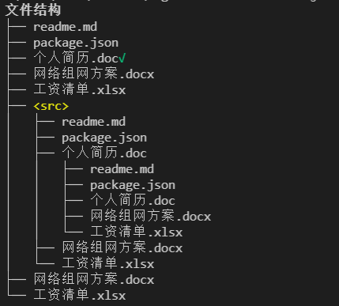
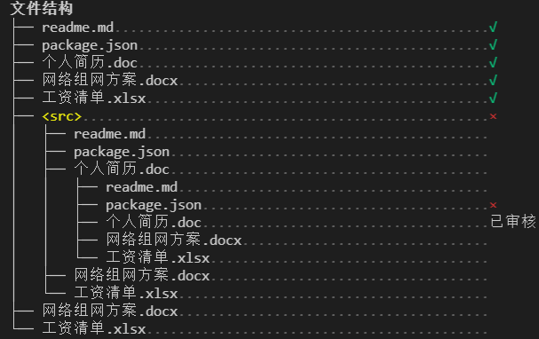

- 列表

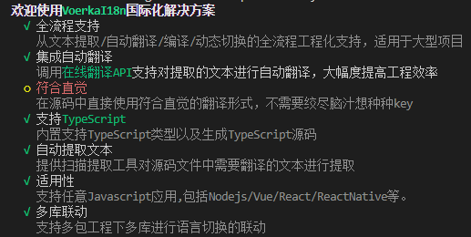

