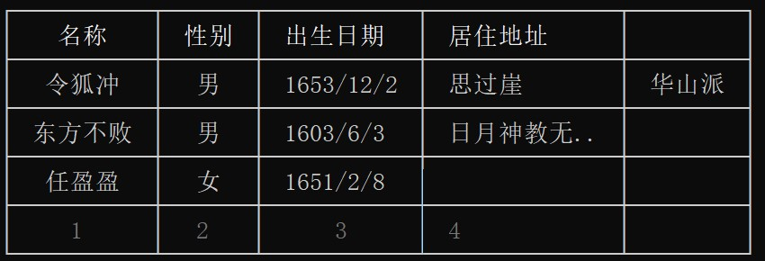

# 关于

为开发`nodejs`命令行程序提供丰富的表现输出样式，支持以下特性：

- 支持按不同数据类型以不同的颜色显示，并且可以配置显示样式
- 支持按`DEBUG`、`INFO`、`WARN `、`ERROR `、`FATAL`五个级别输出日志
- 支持输出带颜色的模板字符串
- 支持自动格式化显示`{}`和`[]`类型
- 支持强大的表格输出
- 支持输出任务列表、进度条、横幅和树等扩展
- 正确处理中文与英文混排时的对齐问题
- 支持扩展插件机制


!> 推荐[VoerkaI18n国际化解决方案](https://zhangfisher.github.io/voerka-i18n/)


# 安装

```shell
npm install logsets
yarn add logsets
pnpm add logsets
```

# 指南

## 创建实例

`logsets`默认自动创建一个实例，可以直接引入使用。

```javascript
import logger from "logsets"
logger.config({...})
```

也可以创建多个实例：

```javascript
import createLogger from "logsets"
const logger = createLogger({...})
```

## 模板字符串输出

对模板字符串进行插值后输出着色后的字符串。

```javascript
import logger from "logsets"
logger.log("<模板字符串>",<变量1>,<变量1>,...,{end:"\n",append:" "})
logger.log("<模板字符串>",<变量1>,<变量1>,...)
logger.log("<模板字符串>",{<变量1>:<值>,<变量1>:<值>},)
logger.log("<模板字符串>",{<变量1>:<值>,<变量1>:<值>},{end:"\n",append:" "})
```
**示例如下：**
```javascript
import logger from "logsets" 
// 命名插值变量
logger.log("{a}+{b}={c}",{a:1,b:1,c:2})
// 位置插值变量
logger.log("My name is {}","tom")
logger.log("{a}+{b}={c}",1,1,2)
```
**输出效果如下：**


默认情况下，每次执行`log`方法完成后均会导致换行输出。`log`方法还支持配置输出参数:
```javascript
for(let i =0 ;  i<=100; i++){
  logger.log("正在下载:{}",i,{end:"\r"})          // 每行输出时最后打印\r回车符，回到行头，从而可以实现下载进度的更新。
}
logger.log()   // 换行
```


**配置参数**
当`log`的参数`大于=2`个并且最后一个参数是`{}`时，将最后一个参数视为是输出配置参数。

```javascript
{
    end:"\n",          // 行结束字符，默认是换行会导致打印下一行，如\r则不会换行而只是回到行首
    append:" "         // 每个输出参数自动追加的字符，默认是一个空格
}
```


## 按数据类型输出

提供`print`方法，用来连续输出多个经过着色的参数。
```javascript
    print(arg1,arg2,arg3,.....)
    print(arg1,arg2,arg3,.....,{end:"\n",append:" "}) // 增加可选的输出参数
```
**输出配置参数：**

同`log`方法.

**示例**

```javascript
import logger from "logsets" 

logger.print("String",true,100,()=>{},[1,2,3])
logger.print(null,undefined)
logger.print(/^colored$/g)
logger.print(new Error("Value Error"))
logger.print(new Date())  
logger.print(class A{})
logger.print(new (class X{})())
logger.print({name:"tom",age:100,admin:true,posts:["a","b"],values:[1,2,3]},()=>"hello")
```
输出效果如下：


## 格式化输出对象

提供`format`方法，用来带缩进格式和着色过的对象

- **基本用法**

```javascript
import logger from "logsets" 

logger.format({
    name:"tom",
    age:11,
    admin:true,
    posts:["经理","主任"],
    address:{
        company:"中华人民共和国北京市二环路",
        family:"福建省泉州市惠安路1512号"
    }
})

```
输出效果如下：


- **优化数组和对象输出**

对数组或对象成员数量当超过指定值时，显示省略号并备注总数量。

```javascript
import logger from "logsets" 

logger.format({
    values:new Array(10).fill(0).map((v,i)=>i+1),
    users:{
        tom:{name:"tom",age:21,sex:true},
        jack:{name:"jack",age:21,sex:false}, 
        jack1:{name:"jack",age:21,sex:false}, 
        jack2:{name:"jack",age:21,sex:false}, 
        jack3:{name:"jack",age:21,sex:false}, 
        jack4:{name:"jack",age:21,sex:false}, 
        jack5:{name:"jack",age:21,sex:false}, 
        jack6:{name:"jack",age:21,sex:false}, 
        jack7:{name:"jack",age:21,sex:false}, 
        jack8:{name:"jack",age:21,sex:false}, 
        jack9:{name:"jack",age:21,sex:false}, 
        jack10:{name:"jack",age:21,sex:false}, 
        jack11:{name:"jack",age:21,sex:false}, 
        jack12:{name:"jack",age:21,sex:false}, 
    }
},{Array:{maxItems:5},Object:{maxItems:5}})

```
`maxItems`参数用来指定只显示多少项，超出显示省略号并备注总数量。


输出效果如下：


**可以配置紧凑模式输出。**

```javascript
import logger from "logsets" 

logger.format({
    values:new Array(10).fill(0).map((v,i)=>i+1),
    users:{
        tom:{name:"tom",age:21,sex:true},
        ...,
        jack12:{name:"jack",age:21,sex:false}, 
    }
},{compact:true, Array:{maxItems:5},Object:{maxItems:5}})

```
`compact`参数用来指示采用紧凑模式输出

输出效果如下：


也可以单独控制Array和Object类型是否采用紧凑模式输出。
```javascript
logger.format({...},{compact:true, Array:{maxItems:5,compact:false},Object:{maxItems:5}})
```

## 显示分割条

`logger.separator(width)`可以输出一条水平分割线， `width`参数是可选的，默认是`60`。

## 输出日志级别

按指定级别输出日志，并会对插值变量进行着色。

```javascript
logger.debug("<模块字符串>",[位置插值变量列表] || {插值变量列表},"备注信息")
logger.info("<模块字符串>",[位置插值变量列表] || {插值变量列表},"备注信息")
logger.warn("<模块字符串>",[位置插值变量列表] || {插值变量列表},"备注信息")
logger.error("<模块字符串>",[位置插值变量列表] || {插值变量列表},"备注信息")
logger.fatal("<模块字符串>",[位置插值变量列表] || {插值变量列表},"备注信息")
```

示例如下：

```javascript
import logger from "logsets" 
logger.debug("正在执行程序{},还需要{}秒...",["logs",9])
logger.info("正在执行程序{app},还需要{time}秒...",{app:"logs",time:9})
logger.warn("正在执行程序{app},还需要{time}秒...",{app:"logs",time:9},"Line:123")
logger.warn("程序执行可能出错\n变量没有定义")
logger.error("程序执行可能出错\n变量没有定义")
logger.fatal("正在执行程序{a} + {b} , {sex} {name}...",{a:1,b:1,sex:true,name:"voerka"})

```
输出效果如下：


第二个参数也可以是一个返回`[]`或`{}`插值变量列表的函数.

```javascript
logger.warn("My name is {name}, age is {age}",()=> ({name:"Voerka",age:1}))
```

输出样式可以通过`template`参数配置模块字符串。 

```javascript
logger.config({
    template:"[{level}] {datetime} - {message}"
})
```

`template`支持以下插值变量：

- **level**：日志级别
- **datetime**：当前日期时间
- **date**：当前日期
- **time**：当前时间
- **message**：文本信息

## 表格输出

`logsets`支持额外引入`table`插件用来输出表格

### 基本用法 

```javascript
import logger from "logsets"
 

const table = logger.table({       
    colorize:1,              // 是否需要颜色化 0-禁用着色,1-简单着色 2-对表单元里面的对象和数组进行着色,需要额外的计算
    grid:2,                  		// 表格线样式,0=不显示表格线,1=只显示垂直表格线,2=显示完整表格线
    maxColWidth:32,          		// 最大列宽,超过会显示省略号
    colPadding:" ",          		// 列额外的空格
    header:{
        style:"bright"       		// 表头颜色样式，默认高亮 
    },                                    
    footer:{
        style:"darkGray",    		// 表尾颜色样式                 
        merge:true           		// 是否合并行
        align:"right",       		// 当合并时对齐方式
    },
    summary:{                		// 默认汇总行配置
        style:"yellow,bright",    	// 汇总颜色样式
        align:"right",            	// 汇总对齐方式
    },   
})
// 输出表头，只支持一个表头
table.addHeader("序号","文件名","大小","下载进度","完成","<备注")
// 输出行，一个参数对应一列
table.addRow(1,"readme.md",58713,100,true,"自述文件")
table.addRow(2,"index.js",1222,100,true,"源代码文件")
table.addRow(3,"consts.js",45981,100,true,"常量定义\n包含默认的配置文件")
table.addRow(4,"table.plugin.js",434,100,true,"表格插件\n可选，用来输出表格")
table.addRow(5,"rollup.config.js",123,100,true,"构建配置文件")
// 输出汇总行
table.addSummary(["已下载",5,"个文件\n累计耗时",56,"秒"],{align:"right"})
table.addRow(6,"colorize.js",6542,60,false,"实现对变量或对象进行着色")
table.addRow(7,"stringify.js",5546,34,false,"格式化JSON") 
table.addRow(8,"utils.js",6456,66,false,"一个工具函数") 
// 输出表尾
table.addFooter(["共",8,"个文件"])
// 渲染输出
table.render()
```

输出效果如下：


### 控制表格线样式 

当`grid=1`时，输出效果如下：


当`grid=2`时，输出效果如下：


### 单元格着色

`table.addRow`进行增加行时，会根据`logsets` 全局配置按不同的数据类型显示不同的颜色。

### 单元格里显示着色对象

默认情况下，在单元格里面显示`{...}`或`[...]`时会将之转化为字符串进行显示，而不是像`format`方法一样进行格式化关色后输出。需要额外配置`colorize=2`才会进行着色输出。

```javascript
table = logger.table({  
   colorize:2,    
})
```

`colorize`参数用来控制是否对单元格内容进行着色。

- **0 :** 禁用着色输出
- **1 :** 对简单数据类型进行着色，默认值
- **2** ：对表单元里面的对象和数组进行着色,需要额外的计算   

### API

table实例具有以下方法：

- **addHeader**

 增加表头，一个表格只能指定一个表头，并且表头不支持多行标题。

```javascript
addHeader("列标题","列标题",......,"列标题")
```

列标题**默认居中显示**，指定列标题时可以通过第一个字符来指定该列的显示对齐方式。如:

```javascript
addHeader("序号","名称",">地址")          // 地址列右对齐
addHeader("序号","名称","<地址")          // 地址列左对齐
```

- **addRow**

表格支持添加任意多的普通表行。

```javascript
addRow(<单元格内容>,<单元格内容>,...,<单元格内容>)
```

一般情况下，单元格的数量应该与`addHeader`中列数量一致。如果`addRow`的参数个数大于`addHeader`的参数个数，会自动扩展列，取最大的列数量进行显示。

```javascript
table = logger.table({ 
    grid:2,
    maxColWidth:12,                                    
})
// 表头定义了4列
table.addHeader("名称","性别","出生日期","<居住地址")
// 该行提供了5个单元格参数
table.addRow("令狐冲","男","1653/12/2","思过崖","华山派")
table.addRow("东方不败","男","1603/6/3","日月神教无敌峰藏经阁")
table.addRow("任盈盈","女","1651/2/8","")  
table.render()
```

- 渲染单元格时会按照配置中指定的样式，分别对不同的数据类型显示不同的颜色。

- 表格行每一列会根据内容自适应宽度显示，但是其最大值受配置参数中的`maxColWidth`约束，当单元格内容字符宽度超过`maxColWidth`时会显示省略号。效果如下：

    

- **addSummary** 
增加汇总行，汇总行用来合并所有单元格并显示内容。

```javascript
addSummary(
    content,                          // 单元格内容
    {
  		style:"yellow,bright",        // 汇总颜色样式
    	align:"right",                // 汇总对齐方式，取值:left,auto,center,right
	})
```

- `content`参数可以是一个字符串，其显示颜色样式由style指定，默认值是`yellow,bright`

- `content`参数也可以是一个Array，其显示颜色样式会根据数组成员的数据类型进行着色。

    效果图参阅上文。

- **addFooter** 
增加表尾，一个表格只能显示一个表尾。


```javascript
addFooter(content,
   {
    style:"darkGray",      // 表尾颜色样式 ,当merge=false时生效
    merge:<true/false>,   // 是否合并行显示,默认true
    align:"left",		  // 对齐方式，取值:left,auto,center,right
    style:""
})
```

- `content`参数用法与`addSummary` 一样。

- 表尾支持可以通过`{merge:<true/false>}`来配置是否合并显示或者分列显示。如`addFooter([1,2,3,4],{merge:false})`  

    

- 默认情况下`merge=true`，即`addFooter("内容")===addFooter("内容",{merge:true})`。

- **addSeparator**

当`grid=0`或`grid=1`即不显示网格线时用来增加一条分割线。

```javascript
    addSeparator()   // 无参数
```

## 进度条

显示一个滚动的进度条。

### 基本用法

```javascript
import logger from "logsets" 

const pbar = logger.progressbar({
    title     : "下载进度",
    //...其他配置参数...
})

progressbar.begin()   	// 开始启动进度条
for(let i = 0 ; i <= 60; i++){
    await delay()
    progressbar.value(i) // 更新进度条
}
progressbar.end()  		 // 结束进度条

```

`progressbar.demo.js`输出效果如下：


### 配置参数

`progressbar`支持以下配置参数：

```javascript
{
    title:"<显示标题>"
    theme     : "",       // 可选主题色，内置支持default,red,green
    max       : 100,      // 进度最大值
    min       : 0,        // 进度最小值
    value     : 0,        // 当前值   
    // 显示在最后的备注字符串,支持插值变量{value} {percent} {max} {min}
    dispaly   : "{percent}%",
    width     : 60,       // 进度条宽度 
    background: {         // 进度条样式
        show  : true,     // 是否显示背景，默认显示，不显示时只显示进度条滑块
        style : "bgDarkGray",       // 进度条样式
        char  : " "
    },       
    slider    : {                // 滑块字符
        style : "bgWhite",       // 进度条样式
        char  : " ",             // 
    } 
}
```

- 所有参数均是可选的，大部份情况下只需要配置`max`、`min`参数即可。
- `dispaly`参数用来控制当进度条正在执行时显示在右侧的信息，支持插值变量`{value}` `{percent}`、` {max} `、`{min}`，比如"{percent}%"显示百分比，"{value}/{max}"显示当前进度值与最大值。
- `width`用来指定进度条的宽度，默认是`60`个字符。
- `background`用来控制进度条的背景，默认是暗灰色空格。
- `slider`用来控制进度值，默认是白色空格。

### API

- **begin()**

  开始一个进度条，开始时会隐藏光标

- **value(n)**

  更新进度

- **end(note)**

  结束进度条，结束后换行

- **stop(note)**

  停止进度条，`note`参数会显示在进度条右侧。

- **error(note)**

  进度条出错，`note`参数会显示在进度条右侧。

## 任务列表

显示正在进行的任务列表，能显示任务的状态。

### 基本用法

```javascript
import logger from "logsets" 

// 创建一个任务列表
let tasks = logger.tasklist({
    title:"指定任务列表标题"            // 高亮显示
})
// let tasks = logger.tasklist("指定列表标题")  只指定标题

// 新增一个任务列表项
tasks.add("开始扫描文件")
// 增加后，任务列表项会处于运行状态，需要分别调用complete/error/stop/skip/todo等结束运行状态
tasks.complete("OK")

tasks.add("准备对文件进行预处理")
tasks.error("ERROR:文件没有找到")

tasks.add("读取文件并编译成exe文件")
tasks.skip("SKIP")

tasks.add("任务处理被停止")
tasks.stop("STOP")

tasks.add("任务待办状态")
tasks.todo("TODO")  

// 任务描述还支持按数字类型进行着色显示
tasks.add(["下载文件:{},已下载{}","package.json",123])

```

运行后的效果如下：


### 配置参数

以下所有配置参数均为可选，仅当您对默认样式不满意时进行定制。

```javascript
 { 
    indent    : "  ",       // 列表项缩进字符 
    style     : "bright",   // 标题样式，可以用red,bgYellow等组合，参阅输出样式，默认是高亮
    width     : 60,         // 列表项总宽度
    refInterval:200,        // 列表项渲染间隔,以ms为单位
    progressbar:{
        style:"darkGray",   // 进度条样式,默认是深灰色
        char:".",           // 进度条字符，当任务处于运行状态时会动态显示
    },
    // 当新任务项后会自动running，后续可以调用方法结束任务
    status:{   
        running:{
            style:"white",
            symbol:"-",
            note:""
        },        
        complete:{
            style:"green",
            symbol:"√",
            note:"OK"
        },
        error:{
            style:"red",
            symbol:"×",
            note:"ERROR"            
        },
        fail:{
            style:"red",
            symbol:"×",
            note:"FAIL"            
        },
        skip:{
            style:"yellow",
            symbol:"○",
            note:"SKIP"
        },
        stop:{
            style:"red",
            symbol:"●",
            note:"STOP"
        },
        todo:{
            style:"lightCyan",
            symbol:"□",
            note:"TODO"
        }
    }  
}
```

除以上`running`、`complete`、`error`、`fail`、`skip`、`stop`、`todo`任务状态外，还支持自定义状态。

```javascript
let tasks = logger.tasklist({
    title:"任务标题",
    status:{
        connected:{
            symbol:"*",
            style:"green"
        }
    }
})
tasks.add("正在连接")
tasks.connected()
```

### API

- **add(title)**

  新增加一个任务，增加后会自动进入运行状态，如果上一个任务还在进行中会自动完成。
  如果`title`是数组，则内部会调用`log`方法输出。因此，任务标题也支持对插值变量进行着色后输出。

- **<状态名称>(note)**

  使当前正在进行的任务结束并进入指定的状态，传入的可选的`note`参数显示在最右侧。

## 横幅

显示一个广告横幅

### 基本用法

```javascript
import logger from "./index.js" 
 
let banner = logger.banner({ })

banner.add("Logsets Utility Toolkit")
banner.add("Output color elements at the terminal")
banner.add("Version: ",1)
banner.add("Release: ","2022-01-01")
banner.render()
```

输出效果如下：


```javascript
banner = logger.banner({ 
    width:60
})
banner.add("Logsets工具库")
banner.add("在终端命令行输出彩色文本",{style:"darkGray"})
banner.add()          // 输出空行
banner.add("版本: ",1)
banner.add("网站: ","http://www.logsets.com",{align: 'left',style:["","lightBlue"]})
banner.add("发布日期: ","2022-01-01",{align: 'right',style:["","lightMagenta"]})
banner.add("作者: ","fisher",{align: 'right',style:["","lightCyan"]})
banner.add("许可证: ","MIT ","GPL ","Apache 2.0",{style:["","red"]})
banner.render()
```


### 配置参数

```javascript
{
    indent       : " ",                          // 横幅整体缩进
    border       : {
        style    : "lightGray",                  // 边框颜色
        width    : 1                             // 边框宽度,0-不显示，1-单线框,2-双线框
    },
    // 第一行自动作为标题行
    title        : {
        align    : "center",                       // 标题对齐方式     
        style    : ["","","green,bright","",""],   // 标题样式颜色
        wrapper  : "☆ ☆ ☆"                       // 标题包裹符号,用来装饰 
    },
    align        : "center",                     // 横幅行默认对齐方式，默认居中
    paddingLeft  : 4,                            // 左右空白宽度，以字符为单位
    paddingRight : 4,
    paddingTop   : 1,                            // 顶部和底部空白行
    paddingBottom: 1
}
```

### API

- **add(arg1,arg2,...,{options})**

  增加行，支持多个输出参数，每个参数均会按照logger的数据类型的配色进行输出。

  如果最后一个参数是`{}`，则支持配置额外的样式和参数。

  ```javascript
  banner.add(arg1,arg2,...,{
  	align:"center | left | right",            // 整体居中、居左、居右
      // 指定该行整行的色彩
      style:"<色彩样式>",						   
   	 // 可以为每一个参数指定颜色。
      style:[
             "<第1个参数的色彩样式>",
             "<第2个参数的色彩样式>",
             "<第3个参数的色彩样式>",
             ...,
             "<第n个参数的色彩样式>"
      ]
  	//当参数个数与style数组长度不匹配时，会取最后一个style[style.length-1] 
  })
  
  // text1显示红色，text2/text3/text4显示黄色
  banner.add("text1","text2","text3","text4",{style:["red","yellow"]})
  
  ```

  

## 树

输出树结构，比如文件夹等。

### 基本用法

```javascript
import logger from "./index.js"  

let tree = logger.tree({
	root:"文件结构"
})
tree.addNode("readme.md")
tree.addNode("package.json")
tree.addNode("个人简历.doc",{note:logger.colors.green("√")})
tree.addNode("网络组网方案.docx")
tree.addNode("工资清单.xlsx") 
tree.addNode("<src>",{style:"yellow"}) 
    tree.beginChildren() 
        tree.addNode("readme.md")
        tree.addNode("package.json")
        tree.addNode("个人简历.doc")
            tree.beginChildren() 
            tree.addNode("readme.md")
            tree.addNode("package.json")
            tree.addNode("个人简历.doc")
            tree.addNode("网络组网方案.docx")
            tree.addNode("工资清单.xlsx",{last:true}) 
            tree.endChildren() 
        tree.addNode("网络组网方案.docx")
        tree.addNode("工资清单.xlsx",{last:true}) 
    tree.endChildren() 
tree.addNode("网络组网方案.docx")
tree.addNode("工资清单.xlsx",{last:true})     
```

输出效果如下：


树还可以配置为每一个节点输出备注信息。

```javascript
let tree = logger.tree({
	root:"文件结构",
    note:{
        enable:true
    }
})
tree.addNode("readme.md",{note:logger.colors.green("√")})
tree.addNode("package.json",{note:logger.colors.green("√")})
tree.addNode("个人简历.doc",{note:logger.colors.green("√")})
tree.addNode("网络组网方案.docx",{note:logger.colors.green("√")})
tree.addNode("工资清单.xlsx",{note:logger.colors.green("√")}) 
tree.addNode("<src>",{style:"yellow",note:logger.colors.red("×")}) 
    tree.beginChildren() 
        tree.addNode("readme.md")
        tree.addNode("package.json")
        tree.addNode("个人简历.doc")
            tree.beginChildren() 
            tree.addNode("readme.md")
            tree.addNode("package.json",{note:logger.colors.red("×")})
            tree.addNode("个人简历.doc",{note:"已审核"})
            tree.addNode("网络组网方案.docx")
            tree.addNode("工资清单.xlsx",{last:true}) 
            tree.endChildren() 
        tree.addNode("网络组网方案.docx")
        tree.addNode("工资清单.xlsx",{last:true}) 
    tree.endChildren() 
tree.addNode("网络组网方案.docx")
tree.addNode("工资清单.xlsx",{last:true})    
```

输出效果如下：


### 配置参数

```javascript
{
    root: "Root",    				// 根节点显示内容
    width: 60,                      // 当显示备注信息时，树的总宽度
    indent:" ",                     // 整体缩进字符
    node:{                        
        style:"",                   // 默认节点样式
    },
    note:{                          // 节点备注
        enable:false,				// 是否显示备注信息
        style:"darkGrey",           // 备注信息的默认样式
        char:".", 					// 备注指示线
    }  
}
```

### API

- **addNode(text,{style,note,last})**

    增加一个树节点

    `style`用来配置节点的显示颜色样式，如`style="red"`时，节节点文本显示为红色。

    `note`用来提供备注信息；

    `last`用来提示这是当前最后一个节点，当添加节点时，树线默认显示`├── `，当`last=true`时，则显示`└── `，这样就可以确保最后一个子节点显示正确。

- `beginChildren()`、`endChildren()`

    开始和结束一个子节点集。

## 输出彩色内容

`logsets`依赖于`ansicolor`，并且将其挂在了`logsets.colors`下，因此也可以直接调用来生成彩色内容。

```javascript
import logger from "./index.js"  

console.log(logger.colors.red(text))
console.log(logger.colors.green(text))
console.log(logger.colors.yellow(text))
console.log(logger.colors.blue(text))
console.log(logger.colors.magenta(text))
console.log(logger.colors.cyan(text))
console.log(logger.colors.white(text))
console.log(logger.colors.darkGray(text))
console.log(logger.colors.black())
//.......更加的着色方法请参考ansicolor文档
```

`logger.colors===ansicolor`实例，可参考其文档。

# 全局配置

绝大多数情况下，`logsets`是开箱即用的，不需要进行配置。
但是`logsets`也支持丰富的配置参数，可以自定义输出样式。
## 默认配置

完整配置如下：

```javascript
import createLogger from "logsets"
const log = createLogger({
    indent: "  ",                                           // 缩进
    singleQuotes: false,                                    // 显示单引号 
    template: "[{level}] {datetime} - {message}",           // 模板
    compact:false,                                          // 是否采用紧凑模式输出
    Array:{
        compact : true,                                     // 是否采用紧凑模式输出
        maxItems: 100,                                      // 数组最大长度，超过则显示省略号
        memo    : (value)=> darkGray("(共"+value.length+"项)")  // 当数组数量超过maxItems时，显示共几项的备注
    },
    Object:{
        compact:true,                                       // 是否采用紧凑模式输出
        maxItems:100,                                       // 成员数量，超过则显示省略号
        align:true,                                         // 是否自动对齐
        memo:(value)=> darkGray("(共"+value.length+"项)"),
    },
    Function : {
        style:"lightCyan",
        format:value=>value.name ? `[Function ${value.name}]` : "()=>{...}"
    },
    AsyncFunction: {
        style:"lightCyan",
        format:value=>value.name ? `[AsyncFunction ${value.name}]` : "async ()=>{...}"
    },
    Error    : {
        style:"red",
        format:e=>`${e.name.firstUpper()}('${e.message}')`
    },
    Null     : "darkGray",
    Undefined: "darkGray",
    Boolean  : "cyan",
    Number   : "yellow",
    String   : "green", 
    Class    : {
        style:"lightCyan",
        format:value=>`[Class ${value.name}]`
    },
    Instance : {
        style:"lightBlue",
        format:value=>`<Class(${value.constructor.name})>`
    },
    Date     : {
        style:"lightBlue",
        format:(value)=>`${value.getFullYear()}-${value.getMonth()+1}-${value.getDate()} ${value.getHours()}:${value.getMinutes()}:${value.getSeconds()}`
    },
    Symbol   : "blue", 
    RegExp   : {
        style:"magenta",
        format:(value)=>`${value.toString()}`
    },
    levels   :{
        align: true,                                        // 是否自动对齐消息
        maxLineChars  : 90,                                 // 每行最大字符数 
        memo     : "darkGray",
        debug    : "lightGray",
        info     : "dim",
        warn     : "yellow",
        error    : "red",
        fatal    : "red"
    } 
})

```

以上是默认的配置，一般情况不需要进行修改覆盖。

## 数据类型显示样式

各种数据类型均可以配置显示样式，支持配置`Array`、`Object`、`Function`、`AsyncFunction`、`Error`、`Date`、`Null`、`Undefuned`、`Boolean`、`Number`、`String`、`Class`、`Instance`，`Symbol`、`Regexp`。

配置数据类型的样式可以按如下方式：

```javascript
// 1. 简单指定类型的样式名称
{
    [数据类型名称]:"<样式名称>,<样式名称>,...,<样式名称>"
}
// 2. 指定类型的样式名称，同时指一个格式化函数来用内容进行格式化
{
    [数据类型名称]:{
    	style:"<样式名称>,<样式名称>,...,<样式名称>",
        format:(value)=>{...<返回格式化后的内容>...}
    }
}
```

显示**样式名称**支持设置一个或多个，同时使用多个时采用`,`分开。

样式名称用来指定以何种前景颜色、背景颜色或修饰样式，支持如下值：

- **普通前景色：**`red`，`green`，`yellow`，`blue`，`magenta`，`cyan`，`white`，`darkGray`，`black`
- **加亮前景色：**`lightRed`，`lightGreen`，`lightYellow`，`lightBlue`，`lightMagenta`，lightCyan	，`lightGray`
- **普通背景色：**`bgRed`，`bgGreen`，`bgYellow`，`bgBlue`，`bgMagenta`，`bgCyan`，`bgWhite`，`bgDarkGray`，`bgBlack`
- **加亮背景色：**`bgLightRed`，`bgLightGreen`，`bgLightYellow`，`bgLightBlue`，`bgLightMagenta`，`bgLightCyan`，`bgLightGray`
- **修饰样式：**`bright`，`dim`，`italic`，`underline`，`inverse`


**举例如下：**

```javascript
logger.config({
    Boolean:"bgLightRed,white"
})
```

代表对`Boolean`类型数据采用**亮红色背景**，**白色文本**方式显示。

**注**: 样式可能受不平操作系统平台差异，部分样式不支持。

## 文本样式

在上述所有功能中均会使用一个`style`参数来配置自定义的显示样式。

`style`参数是一个使用`,`分割的字符串，可以同时应用`1-N`个字符串色彩和样式。比如`style="bgLightRed,white"`代表采用**亮红色背景**，**白色文本**方式显示。

# 开发插件

`logsets`支持开发扩展插件，步骤如下：


## 第一步：定义插件函数
`logsets`插件是一个普通的函数，其传入参数：

- **logger**: 当前`logsets`实例，一般可以直接在其上面挂载插件函数
- **options**： 当前`logsets`实例的配置参数,==`logger.options`

```javascript

export default function(logger,options){
    logger.myplugin = (opts={})=>{
        // ....插件逻辑
    }
}

```
## 第二步：编写插件逻辑

`logsets`插件主要使用当前`logsets`实例的`colorize`,`getColorizer`,`getColorizedTemplate`这三个函数来控制终端输出的颜色。

- `colorize`
  对输入参数按数据类型进行着色，返回着色后的字符串。例:`colorize(1)`,`colorize(true)`,`colorize("logsets")`返回的是根据配置中的数据类型的样式着色后的字符串。
- `getColorizer`
    根据颜色字符串返回一个着色函数，如`red,dim`返回能着红色的函数。
    比如要输出`红色，高亮`的内容，可以`logger.getColorizer("red,bright")("hello logsets")`
- `getColorizedTemplate`
    根据模板字符串插值，输出着色后的内容。例：`getColorizedTemplate("{}+{}={}",1,1,2)`返回的就是经过着色后的字符串。可以直接使用`console.log(getColorizedTemplate("{}+{}={}",1,1,2))`

`logsets`插件也可以直接调用当前插件实例方法(如`print`,`format`,`log)`来显示内容。
需要注意，`colorize`,`getColorizer`,`getColorizedTemplate`这三个函数并不会在控制台输出，仅仅是返回着色后的字符串。

`logsets`也提供了一些工具函数来简化常见的功能。

```javascript
import {
    // 显示/隐藏光标
    hideCursor,              
    showCursor,             
    // 字符串居中/左/右填充，主要是将中文按2个字符处理
    paddingCenter,
    paddingStart,
    paddingEnd,
    // 获取字符串长度，中文按2个字符表示，多行字符串取其中最长的一行
    // 如果是着色过的会自动去掉着色再计算
    getStringWidth,
    // 截取字符串，超过显示省略号，支持中文
    cutstr,
    //截断字符串为多行字符串\
    // truncateString("123456789",3,"*") == "123*456*789"
    // truncateString("123456789",3) == 第一行："123 第二行：456 第三行：*789
    truncateString
    // 输出新行，等效\n
    newline
} from 'logsets/utils' 

```

## 第三步：注册插件

```javascript
import logger from 'logsets'
import MyPlugin from 'my-plugin'
logger.use(MyPlugin)
```

# API

`logsets`实例`API`如下：

| 名称 | 说明 | 
| :--- | :--- |
| `log(message,...args)` | 对模板字符串进行插值后输出着色后的字符串 |
| `print(...args)` | 根据输入参数的参数类型进行着色输出，比如可以输出JSON ，同`console.log`,差别就在于输出内容的着色|
| `format(value,options)` | 输出带缩进格式和着色过的对象 |
| `debug(...args)` | 输出DEBUG日志，并会对插值变量进行着色。 |
| `info(...args)` |输出INFO日志，并会对插值变量进行着色。  |
| `warn(...args)` | 输出WARN日志，并会对插值变量进行着色。 |
| `error(...args)` | 输出ERROR日志，并会对插值变量进行着色。 |
| `fatal(...args)` | 输出FATAL日志，并会对插值变量进行着色。 |
| `use(plugin)` | 安装插件  |
| `colorize(arg)` | 对输入参数按数据类型进行着色，返回着色后的字符串   |
| `getColorizer(colors)` | 根据颜色字符串返回一个着色函数，如`red,dim`返回能着红色的函数。 |
| `getColorizedTemplate(template, ...args)` |根据模板字符串插值，输出着色后的内容  |
| `separator(width, char= "─")` | 输出一个分割线 |
| `options` | 返回当前配置参数 |
| `colors` | 返回[ansicolor](https://xpl.github.io/ansicolor/)实例 |
| `config(options={})` | 配置 |

# 更新历史

## 1.0.17

- 修复`logger.tasklist(title)`未生效的问题.

## 1.0.16

- 更新文档
- 增加`logsets/utils`用来提供一些工具函数

## 1.0.15

- 内置默认创建`logsets`实例,可以直接引入

``` javascript
import logger from "logsets"
- const logger = createLogger({...})    
```

- `getColorizedTemplate` 支持通过数组方式来返回着色后的内容

``` javascript
import logger from "logsets"
console.log(logger.getColorizedTemplate(["{} + {} = {}",1,1,2]))

// ---以下方式也是支持的，可以创建多个实例----
import createLogger from "logsets"
const logger = createLogger({...}) 

```

- 修复TaskList的标题输出

``` javascript
import logger from "logsets"
const tasks = logger.tasklist({
    title:"标题",               // 默认高亮输出
    title:["共{}个任务",8]      // 默认高亮输出，并且插传值内容按数据类型着色显示
})
//或者
const tasks = logger.tasklist("标题")

```

## 1.0.14

- 将所有插件内置，不再需要额外引入。

```javascript
import createLogger from "logsets"
- import tablePlugin from "logsets/plugins/table"  // 不再需要额外引入
const logger = createLogger({...})
- logger.use(tablePlugin)    // 不再需要额外引入
```
## 1.0.8

- format方法可以通过`{compact:true}`配置支持采用紧凑模式输出。

 