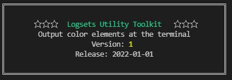

# 横幅

显示一个广告横幅

### 基本用法

```javascript
import logsets from "./index.js" 
 
let banner = logsets.banner({ })

banner.add("Logsets Utility Toolkit")
banner.add("Output color elements at the terminal")
banner.add("Version: ",1)
banner.add("Release: ","2022-01-01")
banner.render()
```

输出效果如下：



```javascript
banner = logsets.banner({ 
    width:60
})
banner.add("Logsets工具库")
banner.add("在终端命令行输出彩色文本",{style:"darkGray"})
banner.add()          // 输出空行
banner.add("版本: ",1)
banner.add("网站: ","http://www.logsets.com",{align: 'left',style:["","lightBlue"]})
banner.add("发布日期: ","2022-01-01",{align: 'right',style:["","lightMagenta"]})
banner.add("作者: ","fisher",{align: 'right',style:["","lightCyan"]})
banner.add("许可证: ","MIT ","GPL ","Apache 2.0",{style:["","red"]})
banner.render()
```


## 配置参数

```javascript
{
    indent       : " ",                          // 横幅整体缩进
    border       : {
        style    : "lightGray",                  // 边框颜色
        width    : 1                             // 边框宽度,0-不显示，1-单线框,2-双线框
    },
    // 第一行自动作为标题行
    title        : {
        align    : "center",                       // 标题对齐方式     
        style    : ["","","green,bright","",""],   // 标题样式颜色
        wrapper  : "☆ ☆ ☆"                       // 标题包裹符号,用来装饰 
    },
    align        : "center",                     // 横幅行默认对齐方式，默认居中
    paddingLeft  : 4,                            // 左右空白宽度，以字符为单位
    paddingRight : 4,
    paddingTop   : 1,                            // 顶部和底部空白行
    paddingBottom: 1
}
```


## API

- **add(arg1,arg2,...,{options})**

  增加行，支持多个输出参数，每个参数均会按照logger的数据类型的配色进行输出。

  如果最后一个参数是`{}`，则支持配置额外的样式和参数。

  ```javascript
  banner.add(arg1,arg2,...,{
  	align:"center | left | right",            // 整体居中、居左、居右
      // 指定该行整行的色彩
      style:"<色彩样式>",						   
   	 // 可以为每一个参数指定颜色。
      style:[
             "<第1个参数的色彩样式>",
             "<第2个参数的色彩样式>",
             "<第3个参数的色彩样式>",
             ...,
             "<第n个参数的色彩样式>"
      ]
  	//当参数个数与style数组长度不匹配时，会取最后一个style[style.length-1] 
  })
  
  // text1显示红色，text2/text3/text4显示黄色
  banner.add("text1","text2","text3","text4",{style:["red","yellow"]})
  
  ```
