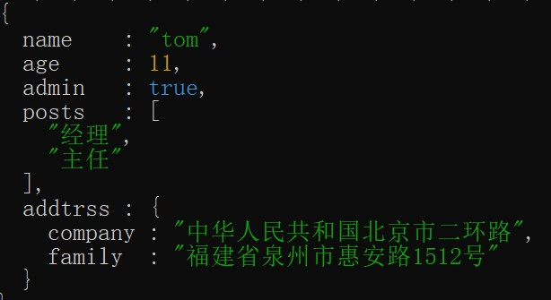
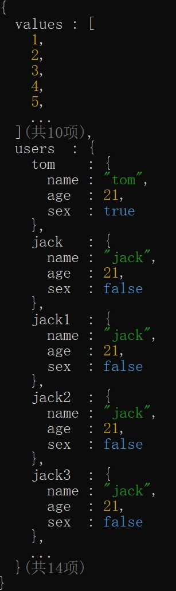

# 格式化输出

提供`format`方法，用来带缩进格式和着色过的对象

## 基本用法

```javascript
import logsets from "logsets" 

logsets.format({
    name:"tom",
    age:11,
    admin:true,
    posts:["经理","主任"],
    address:{
        company:"中华人民共和国北京市二环路",
        family:"福建省泉州市惠安路1512号"
    }
})

```
输出效果如下：



## 优化数组和对象输出

对数组或对象成员数量当超过指定值时，显示省略号并备注总数量。

```javascript
import logsets from "logsets" 

logsets.format({
    values:new Array(10).fill(0).map((v,i)=>i+1),
    users:{
        tom:{name:"tom",age:21,sex:true},
        jack:{name:"jack",age:21,sex:false}, 
        jack1:{name:"jack",age:21,sex:false}, 
        jack2:{name:"jack",age:21,sex:false}, 
        jack3:{name:"jack",age:21,sex:false}, 
        jack4:{name:"jack",age:21,sex:false}, 
        jack5:{name:"jack",age:21,sex:false}, 
        jack6:{name:"jack",age:21,sex:false}, 
        jack7:{name:"jack",age:21,sex:false}, 
        jack8:{name:"jack",age:21,sex:false}, 
        jack9:{name:"jack",age:21,sex:false}, 
        jack10:{name:"jack",age:21,sex:false}, 
        jack11:{name:"jack",age:21,sex:false}, 
        jack12:{name:"jack",age:21,sex:false}, 
    }
},{Array:{maxItems:5},Object:{maxItems:5}})

```
`maxItems`参数用来指定只显示多少项，超出显示省略号并备注总数量。


输出效果如下：



## 紧凑模式输出

可以配置紧凑模式输出。

```javascript
import logsets from "logsets" 

logsets.format({
    values:new Array(10).fill(0).map((v,i)=>i+1),
    users:{
        tom:{name:"tom",age:21,sex:true},
        ...,
        jack12:{name:"jack",age:21,sex:false}, 
    }
},{compact:true, Array:{maxItems:5},Object:{maxItems:5}})

```
`compact`参数用来指示采用紧凑模式输出

输出效果如下：


也可以单独控制Array和Object类型是否采用紧凑模式输出。
```javascript
logsets.format({...},{
    compact:true, 
    Array:{
        maxItems:5,
        compact:false
    },
    Object:{
        maxItems:5
    }
})
```

`logsets.format`支持指定一个`{title:"标题"}`参数，用来输出一个带标题的对象。
