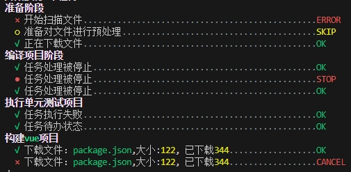
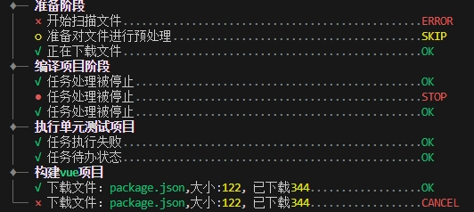

# 分组任务列表

使用`logsets.createTasks`可以创建一个分组任务列表，然后通过`logsets.run`来执行任务列表。

## 创建分组任务列表

创建任务列表时，可以使用`string`或`string[]`来创建一个任务分组标题。


```javascript
const taskList =[
	"准备阶段",        //组标题   // [!code ++]    
	{   title: "开始扫描文件",
		execute: async function () {return 'error'},
	},{ title: "准备对文件进行预处理",
		execute: async function () {return 'skip'},
	},
	{ title: "正在下载文件",
	  execute: async function ({task}) {....},
	}, 
	"编译项目阶段",  // 组标题 // [!code ++]   
	{ title: "任务处理被停止",
	   execute: async function () {...},
	},{ title: "任务处理被停止",
		execute: async function () {...},
	},{ title: "任务处理被停止",
		execute: async function () {...},
	},	
	"执行单元测试项目",    // 组标题 // [!code ++]  
	{
		title: "任务执行失败",
		execute: async function () {
			await delay(); 
		},
	},
	{
		title: "任务待办状态",
		execute: async function () {
			await delay();
		},
	},	
	["构建{}项目","vue"],  // 组标题，支持插值变量着色 // [!code ++]    
	{
		title: ["下载文件：{},大小:{}, 已下载{}", "package.json", 122, 344],
		execute: async function () {
			await delay();
		},
	},
	{
		title: ["下载文件：{},大小:{}, 已下载{}", ["package.json", 122, 344]],
		execute: async function () {
			await delay();
			return 'cancel'
		},
	},
]
let tasks = logsets.createTasks(taskList);
```

输出效果如下：




## 显示分组线

可以通过`grouped`参数来显示分组线。

```javascript
const taskList =[
	// ....
]
let tasks = logsets.createTasks(taskList,{
    grouped: true       // 显示分组线   // [!code ++]
});
```

