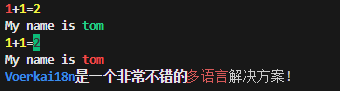

# 标题

`logsets.header(message,...args)`可以输出高亮标题.

```js
  logsets.header("{#red a}+{b}={c}",{a:1,b:1,c:2})
  // 位置插值变量
  logsets.header("My name is {}","tom")
  logsets.header("{a}+{b}={#bgGreen c}",1,1,2)

  logsets.header("My name is {#red tom}")
  logsets.h("{#blue Voerkai18n}是一个非常不错的{#red,dim 多语言}解决方案!")

```

**效果如下:**



:::warning 
`logsets.h`是`logsets.header`的简写
:::