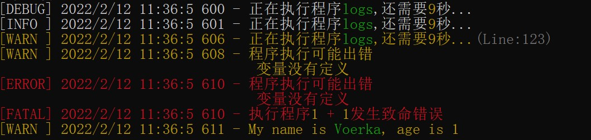

# 日志输出

按指定级别输出日志，并会对插值变量进行着色。

```javascript
logsets.debug("<模块字符串>",[位置插值变量列表] || {插值变量列表},"备注信息")
logsets.info("<模块字符串>",[位置插值变量列表] || {插值变量列表},"备注信息")
logsets.warn("<模块字符串>",[位置插值变量列表] || {插值变量列表},"备注信息")
logsets.error("<模块字符串>",[位置插值变量列表] || {插值变量列表},"备注信息")
logsets.fatal("<模块字符串>",[位置插值变量列表] || {插值变量列表},"备注信息")
```

示例如下：

```javascript
import logsets from "logsets" 
logsets.debug("正在执行程序{},还需要{}秒...",["logs",9])
logsets.info("正在执行程序{app},还需要{time}秒...",{app:"logs",time:9})
logsets.warn("正在执行程序{app},还需要{time}秒...",{app:"logs",time:9},"Line:123")
logsets.warn("程序执行可能出错\n变量没有定义")
logsets.error("程序执行可能出错\n变量没有定义")
logsets.fatal("正在执行程序{a} + {b} , {sex} {name}...",{a:1,b:1,sex:true,name:"voerka"})

```
输出效果如下：



第二个参数也可以是一个返回`[]`或`{}`插值变量列表的函数.

```javascript
logsets.warn("My name is {name}, age is {age}",()=> ({name:"Voerka",age:1}))
```

输出样式可以通过`template`参数配置模块字符串。 

```javascript
logsets.config({
    template:"[{level}] {datetime} - {message}"
})
```

`template`支持以下插值变量：

- **level**：日志级别
- **datetime**：当前日期时间
- **date**：当前日期
- **time**：当前时间
- **message**：文本信息
