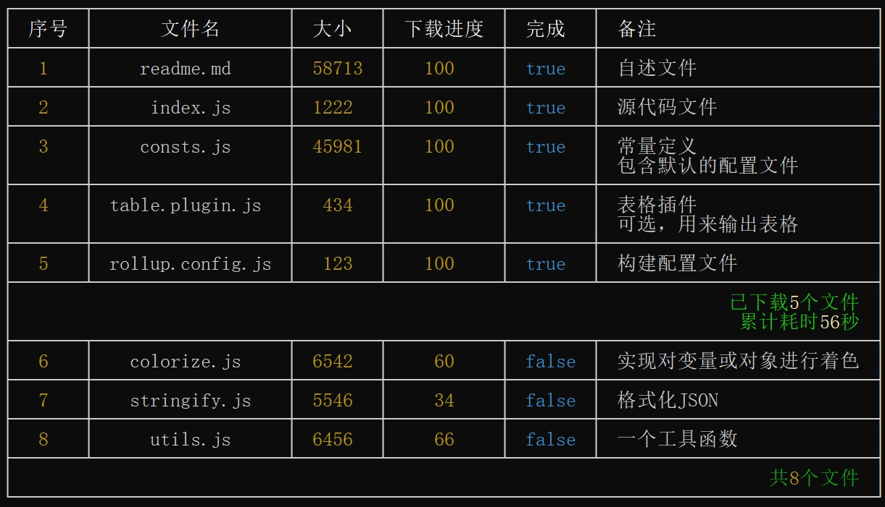

# 表格

`logsets`内置支持`table`插件用来输出表格

## 基本用法 

```javascript
import logsets from "logsets"
 

const table = logsets.table({       
    colorize:1,              // 是否需要颜色化 0-禁用着色,1-简单着色 2-对表单元里面的对象和数组进行着色,需要额外的计算
    grid:2,                  		// 表格线样式,0=不显示表格线,1=只显示垂直表格线,2=显示完整表格线
    maxColWidth:32,          		// 最大列宽,超过会显示省略号
    colPadding:" ",          		// 列额外的空格
    header:{
        style:"bright"       		// 表头颜色样式，默认高亮 
    },                                    
    footer:{
        style:"darkGray",    		// 表尾颜色样式                 
        merge:true           		// 是否合并行
        align:"right",       		// 当合并时对齐方式
    },
    summary:{                		// 默认汇总行配置
        style:"yellow,bright",    	// 汇总颜色样式
        align:"right",            	// 汇总对齐方式
    },   
})
// 输出表头，只支持一个表头
table.addHeader("序号","文件名","大小","下载进度","完成","<备注")
// 输出行，一个参数对应一列
table.addRow(1,"readme.md",58713,100,true,"自述文件")
table.addRow(2,"index.js",1222,100,true,"源代码文件")
table.addRow(3,"consts.js",45981,100,true,"常量定义\n包含默认的配置文件")
table.addRow(4,"table.plugin.js",434,100,true,"表格插件\n可选，用来输出表格")
table.addRow(5,"rollup.config.js",123,100,true,"构建配置文件")
// 输出汇总行
table.addSummary(["已下载",5,"个文件\n累计耗时",56,"秒"],{align:"right"})
table.addRow(6,"colorize.js",6542,60,false,"实现对变量或对象进行着色")
table.addRow(7,"stringify.js",5546,34,false,"格式化JSON") 
table.addRow(8,"utils.js",6456,66,false,"一个工具函数") 
// 输出表尾
table.addFooter(["共",8,"个文件"])
// 渲染输出
table.render()
```

输出效果如下：


## 控制表格线样式 

当`grid=1`时，输出效果如下：


当`grid=2`时，输出效果如下：



## 单元格着色

`table.addRow`进行增加行时，会根据`logsets` 全局配置按不同的数据类型显示不同的颜色。

## 单元格里显示着色对象

默认情况下，在单元格里面显示`{...}`或`[...]`时会将之转化为字符串进行显示，而不是像`format`方法一样进行格式化关色后输出。需要额外配置`colorize=2`才会进行着色输出。

```javascript
table = logsets.table({  
   colorize:2,    
})
```

`colorize`参数用来控制是否对单元格内容进行着色。

- **0 :** 禁用着色输出
- **1 :** 对简单数据类型进行着色，默认值
- **2** ：对表单元里面的对象和数组进行着色,需要额外的计算   

## API

table实例具有以下方法：

### addHeader

 增加表头，一个表格只能指定一个表头，并且表头不支持多行标题。

```javascript
addHeader("列标题","列标题",......,"列标题")
```

列标题**默认居中显示**，指定列标题时可以通过第一个字符来指定该列的显示对齐方式。如:

```javascript
addHeader("序号","名称",">地址")          // 地址列右对齐
addHeader("序号","名称","<地址")          // 地址列左对齐
```

### addRow

表格支持添加任意多的普通表行。

```javascript
addRow(<单元格内容>,<单元格内容>,...,<单元格内容>)
```

一般情况下，单元格的数量应该与`addHeader`中列数量一致。如果`addRow`的参数个数大于`addHeader`的参数个数，会自动扩展列，取最大的列数量进行显示。

```javascript
table = logsets.table({ 
    grid:2,
    maxColWidth:12,                                    
})
// 表头定义了4列
table.addHeader("名称","性别","出生日期","<居住地址")
// 该行提供了5个单元格参数
table.addRow("令狐冲","男","1653/12/2","思过崖","华山派")
table.addRow("东方不败","男","1603/6/3","日月神教无敌峰藏经阁")
table.addRow("任盈盈","女","1651/2/8","")  
table.render()
```

- 渲染单元格时会按照配置中指定的样式，分别对不同的数据类型显示不同的颜色。

- 表格行每一列会根据内容自适应宽度显示，但是其最大值受配置参数中的`maxColWidth`约束，当单元格内容字符宽度超过`maxColWidth`时会显示省略号。效果如下：

    

### addSummary

增加汇总行，汇总行用来合并所有单元格并显示内容。

```javascript
addSummary(
    content,                          // 单元格内容
    {
  		style:"yellow,bright",        // 汇总颜色样式
    	align:"right",                // 汇总对齐方式，取值:left,auto,center,right
	})
```

- `content`参数可以是一个字符串，其显示颜色样式由style指定，默认值是`yellow,bright`

- `content`参数也可以是一个Array，其显示颜色样式会根据数组成员的数据类型进行着色。

    效果图参阅上文。

### addFooter

增加表尾，一个表格只能显示一个表尾。


```javascript
addFooter(content,
   {
    style:"darkGray",      // 表尾颜色样式 ,当merge=false时生效
    merge:<true/false>,   // 是否合并行显示,默认true
    align:"left",		  // 对齐方式，取值:left,auto,center,right
    style:""
})
```

- `content`参数用法与`addSummary` 一样。

- 表尾支持可以通过`{merge:<true/false>}`来配置是否合并显示或者分列显示。如`addFooter([1,2,3,4],{merge:false})`  

    

- 默认情况下`merge=true`，即`addFooter("内容")===addFooter("内容",{merge:true})`。

### addSeparator

当`grid=0`或`grid=1`即不显示网格线时用来增加一条分割线。

```javascript
    addSeparator()   // 无参数
```
