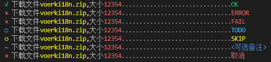

# 任务

## 创建单个任务

显示正在执行的单个任务，输出效果与`tasklist`一样，差别在于`task`只显示一项任务，并且没有缩进。

```javascript
let task = logsets.task("下载文件{#yellow voerki18n.zip},大小{#red size}",{size:12354})
task.complete()
task = logsets.task("下载文件{#yellow voerki18n.zip},大小{#red size}",{size:12354})
task.error()
task = logsets.task("下载文件{#yellow voerki18n.zip},大小{#red size}",{size:12354})
task.fail()
task = logsets.task("下载文件{#yellow voerki18n.zip},大小{#red size}",{size:12354})
task.todo()
task = logsets.task("下载文件{#yellow voerki18n.zip},大小{#red size}",{size:12354})
task.skip()
task = logsets.task("下载文件{#yellow voerki18n.zip},大小{#red size}",{size:12354})
task.ignore("<可选备注>")
task = logsets.task("下载文件{#yellow voerki18n.zip},大小{#red size}",{size:12354})
task.cancel("取消")
// 也可以采用插值变量，对变量进行着色输出
let task = logsets.task("下载文件：{},大小:{}, 已下载{}","package.json",122,344)

let task 
try{
    task = logsets.task("下载文件{#yellow voerki18n.zip},大小{#red size}",{size:12354})
    task.complete()
}catch(e){
    task.error(e.message)
}


```
输出效果如下:




## 直接执行任务

更方便的使用方式如下：


```js
    await logsets.task("正常执行任务",async ()=>{
        await delay(1000)        
    })
    await logsets.task("正常任务出错",async ()=>{
        await delay(1000)        
        throw new Error("任务出错")
    })
    await logsets.task("正常任务跳过",async ()=>{
        await delay(1000)        
        return "skip"
    })
    await logsets.task("正常任务取消",async ()=>{
        await delay(1000)        
        return "cancel"
    })
    await logsets.task("正常任务停止",async ()=>{
        await delay(1000)        
        return ["stop","任务停止"]
    })
    await logsets.task(["正常执行任务:{}","voerkai18n"],async ()=>{
        await delay(1000)        
    })
    // 传入一个task
    await logsets.task(["正常执行任务:{}","voerkai18n"],async (task)=>{ 
        for(let i=0;i<10;i++){
            task.note(i+1)
            await delay(100)
        }
    })
```

- 通过`task.note(text)`可以更新任务备注信息