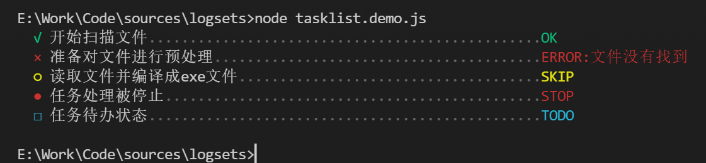

# 任务列表

显示正在进行的任务列表，能显示任务的状态。



## 基本用法

```javascript
import logsets from "logsets" 

// 创建一个任务列表
let tasks = logsets.tasklist({
    title:"指定任务列表标题"            // 高亮显示
    //  标题支持插值变量着色
    title:"所有任务:{#yellow 8}个",
    title:["所有任务:{}个",8]
    title:["所有任务:{count}个",{count:100}]
})
// let tasks = logsets.tasklist("指定列表标题")  只指定标题

// 新增一个任务列表项
tasks.add("开始扫描文件")
// 支持插值变量着色
//tasks.add("开始扫描文件")
//tasks.add("开始扫描文件,数量{#yellow 100}")
// 增加后，任务列表项会处于运行状态，需要分别调用complete/error/stop/skip/todo等结束运行状态
tasks.complete("OK")

tasks.add("准备对文件进行预处理")
tasks.error("ERROR:文件没有找到")

tasks.add("读取文件并编译成exe文件")
tasks.skip("SKIP")

tasks.add("任务处理被停止")
tasks.stop("STOP")

tasks.add("任务待办状态")
tasks.todo("TODO")  

// 任务描述还支持对插值变量按数据类型进行着色显示
tasks.add("下载文件：{},大小:{}, 已下载{}","package.json",122,344)

// 任务描述着色显示
tasks.add("下载文件：{#red },大小:{}, 已下载{}",["package.json",122,344])


// 可以在任务列表之间插入一个分割线
tasks.separator()

// 增加缩进，每次调用增加一个缩进，可多次调用
tasks.indent()  
// 减少缩进
tasks.outdent()  


// 一般用法

try{
    tasks.add("正在下载文件{}","file.zip")
    await http.download(url)
    tasks.complete()            // 任务完成后调用
}catch(e){
    tasks.error(e)              // 出错时调用
}

// 如果有多个任务则需要多个重复上述代码，因此提供了一个快捷方法

tasks.run("正在下载文件{}","file.zip",async () => {
    await http.download(url)
    // 未返回任意值 等效于 task.complete()
    // return "字符串"  等效于 task.complete("字符串")
    // return 'ignore' | 'running' | 'complete' | 'error' | 'abort' | 'fail' | 'cancel' | 'skip' | 'stop' | 'todo' | 'ignore'
    // 返回以上字符串 等效于 task.fail()  task.running() , 
    // 返回[以上字符串,"xxx"] 等效于 task.fail("xxx")  task.running("xxx") , 
},{
    catchError:true                 // 是否捕获错误,=false则执行出错时会抛出错误,导致后续任务不能执行
    showErrorStack:false            // 出错时是否显示错误信息
})

const result = await tasks.run("正在下载文件{}","a.zip", ()=>{
     delay(1000)    
     return "skip"
})

// result === "skip"

await tasks.run("正在下载文件{}","a.zip", ()=>{
    delay(1000)    
    return ["abort","用户中止"]
})

// result === ["abort","用户中止"]


```

运行后的效果如下：


## 配置参数

以下所有配置参数均为可选，仅当您对默认样式不满意时进行定制。

```javascript
 { 
    indent    : "  ",       // 列表项缩进字符 
    style     : "bright",   // 标题样式，可以用red,bgYellow等组合，参阅输出样式，默认是高亮
    width     : 60,         // 列表项总宽度
    refInterval:200,        // 列表项渲染间隔,以ms为单位
    progressbar:{
        style:"darkGray",   // 进度条样式,默认是深灰色
        char:".",           // 进度条字符，当任务处于运行状态时会动态显示
    },
    // 当新任务项后会自动running，后续可以调用方法结束任务
    status:{   
        running:{
            style:"white",
            symbol:"-",
            note:""
        },        
        complete:{
            style:"green",
            symbol:"√",
            note:"OK"
        },
        error:{
            style:"red",
            symbol:"×",
            note:"ERROR"            
        },
        fail:{
            style:"red",
            symbol:"×",
            note:"FAIL"            
        },
        skip:{
            style:"yellow",
            symbol:"○",
            note:"SKIP"
        },
        stop:{
            style:"red",
            symbol:"●",
            note:"STOP"
        },
        todo:{
            style:"lightCyan",
            symbol:"□",
            note:"TODO"
        },
        ignore:{
            style:"blue",
            symbol:"~",
            note:"IGNORE"
        },
        cancel:{
            style:"red",
            symbol:"×",
            note:"CANCEL"            
        }
    }  
}
```

除以上`running`、`complete`、`error`、`fail`、`skip`、`stop`、`todo`任务状态外，还支持自定义状态。

```javascript
let tasks = logsets.tasklist({
    title:"任务标题",
    status:{
        connected:{
            symbol:"*",
            style:"green"
        }
    }
})
tasks.add("正在连接")
tasks.connected()
```

## API

- **add(title)**

  新增加一个任务，增加后会自动进入运行状态，如果上一个任务还在进行中会自动完成。
  如果`title`是数组，则内部会调用`log`方法输出。因此，任务标题也支持对插值变量进行着色后输出。

- **<状态名称>(note)**

  使当前正在进行的任务结束并进入指定的状态，传入的可选的`note`参数显示在最右侧。

- **indent**

    增加缩进，每次调用增加一个缩进，可多次调用

- **outdent**

    减少缩进


