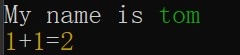

# 模板字符串输出

## 基本用法

对模板字符串进行插值后输出着色后的字符串。

```javascript
import logsets from "logsets"
logsets.log("<模板字符串>",<变量1>,<变量1>,...,{end:"\n",append:" "})
logsets.log("<模板字符串>",<变量1>,<变量1>,...)
logsets.log("<模板字符串>",{<变量1>:<值>,<变量1>:<值>},)
logsets.log("<模板字符串>",{<变量1>:<值>,<变量1>:<值>},{end:"\n",append:" "})
```

### 示例

**示例如下：**

```javascript
import logsets from "logsets" 
// 命名插值变量
logsets.log("{a}+{b}={c}",{a:1,b:1,c:2})
// 位置插值变量
logsets.log("My name is {}","tom")
logsets.log("{a}+{b}={c}",1,1,2)
```

### 输出效果

**输出效果如下：**




默认情况下，每次执行`log`方法完成后均会导致换行输出。`log`方法还支持配置输出参数:
```javascript
for(let i =0 ;  i<=100; i++){
  logsets.log("正在下载:{}",i,{end:"\r"})          // 每行输出时最后打印\r回车符，回到行头，从而可以实现下载进度的更新。
}
logsets.log()   // 换行
```
## 自定义插值变量颜色

默认情况下`logsets.log`会根据插值变量的数据类型分别着色后显示,但也支持自定义颜色显示.

!> 在插值变量占位符中使用`{#<颜色样式> <变量名称>}`的形式来指定颜色


```javascript
import logsets from "logsets" 
// 命名插值变量
logsets.log("{#red a}+{b}={c}",{a:1,b:1,c:2})
// 位置插值变量
logsets.log("My name is {}","tom")
logsets.log("{a}+{b}={#bgGreen c}",1,1,2)
logsets.log("{a}+{b}={#bgGreen,dim c}",1,1,2) // 多个颜色组合用,分开
```

输出如下:


## 对字符串进行局部着色

`logsets.log`在没有提供配套的插值变量时会原样输出变量,复用此特性就可以实现对字符串进行局部着色.


```javascript
import logsets from "logsets" 
// 命名插值变量
logsets.log("My name is {#red tom}")
logsets.log("{#blue Voerkai18n}是一个非常不错的{#red,dim 多语言}解决方案!")
```

输出如下:


## 配置参数

当`log`的参数`大于=2`个并且最后一个参数是`{}`时，将最后一个参数视为是输出配置参数。

```javascript
{
    // 行结束字符，默认是换行会导致打印下一行，如\r则不会换行而只是回到行首
    end:"\n",          
    // 每个输出参数自动追加的字符，默认是一个空格
    append:" "         
}
```