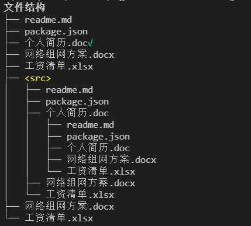
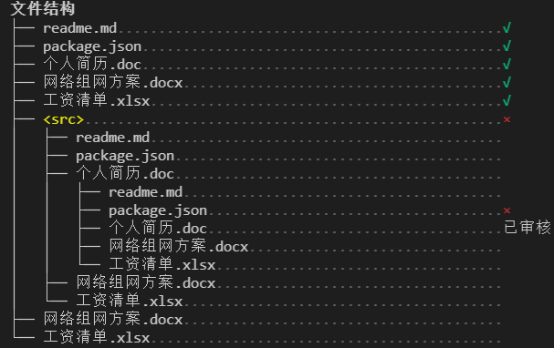

# 树

输出树结构，比如文件夹等。

## 基本用法

```javascript
import logsets from "./index.js"  

let tree = logsets.tree({
	root:"文件结构"
})
tree.addNode("readme.md")
tree.addNode("package.json")
tree.addNode("个人简历.doc",{note:logsets.colors.green("√")})
tree.addNode("网络组网方案.docx")
tree.addNode("工资清单.xlsx") 
tree.addNode("<src>",{style:"yellow"}) 
    tree.beginChildren() 
        tree.addNode("readme.md")
        tree.addNode("package.json")
        tree.addNode("个人简历.doc")
            tree.beginChildren() 
            tree.addNode("readme.md")
            tree.addNode("package.json")
            tree.addNode("个人简历.doc")
            tree.addNode("网络组网方案.docx")
            tree.addNode("工资清单.xlsx",{last:true}) 
            tree.endChildren() 
        tree.addNode("网络组网方案.docx")
        tree.addNode("工资清单.xlsx",{last:true}) 
    tree.endChildren() 
tree.addNode("网络组网方案.docx")
tree.addNode("工资清单.xlsx",{last:true})     
```

输出效果如下：



树还可以配置为每一个节点输出备注信息。

```javascript
let tree = logsets.tree({
	root:"文件结构",
    note:{
        enable:true
    }
})
tree.addNode("readme.md",{note:logsets.colors.green("√")})
tree.addNode("package.json",{note:logsets.colors.green("√")})
tree.addNode("个人简历.doc",{note:logsets.colors.green("√")})
tree.addNode("网络组网方案.docx",{note:logsets.colors.green("√")})
tree.addNode("工资清单.xlsx",{note:logsets.colors.green("√")}) 
tree.addNode("<src>",{style:"yellow",note:logsets.colors.red("×")}) 
    tree.beginChildren() 
        tree.addNode("readme.md")
        tree.addNode("package.json")
        tree.addNode("个人简历.doc")
            tree.beginChildren() 
            tree.addNode("readme.md")
            tree.addNode("package.json",{note:logsets.colors.red("×")})
            tree.addNode("个人简历.doc",{note:"已审核"})
            tree.addNode("网络组网方案.docx")
            tree.addNode("工资清单.xlsx",{last:true}) 
            tree.endChildren() 
        tree.addNode("网络组网方案.docx")
        tree.addNode("工资清单.xlsx",{last:true}) 
    tree.endChildren() 
tree.addNode("网络组网方案.docx")
tree.addNode("工资清单.xlsx",{last:true})    
```

输出效果如下：



## 配置参数

```javascript
{
    root: "Root",    				// 根节点显示内容
    width: 60,                      // 当显示备注信息时，树的总宽度
    indent:" ",                     // 整体缩进字符
    node:{                        
        style:"",                   // 默认节点样式
    },
    note:{                          // 节点备注
        enable:false,				// 是否显示备注信息
        style:"darkGrey",           // 备注信息的默认样式
        char:".", 					// 备注指示线
    }  
}
```

## API

- **addNode(text,{style,note,last})**

    增加一个树节点

    `style`用来配置节点的显示颜色样式，如`style="red"`时，节节点文本显示为红色。

    `note`用来提供备注信息；

    `last`用来提示这是当前最后一个节点，当添加节点时，树线默认显示`├── `，当`last=true`时，则显示`└── `，这样就可以确保最后一个子节点显示正确。

- `beginChildren()`、`endChildren()`

    开始和结束一个子节点集。